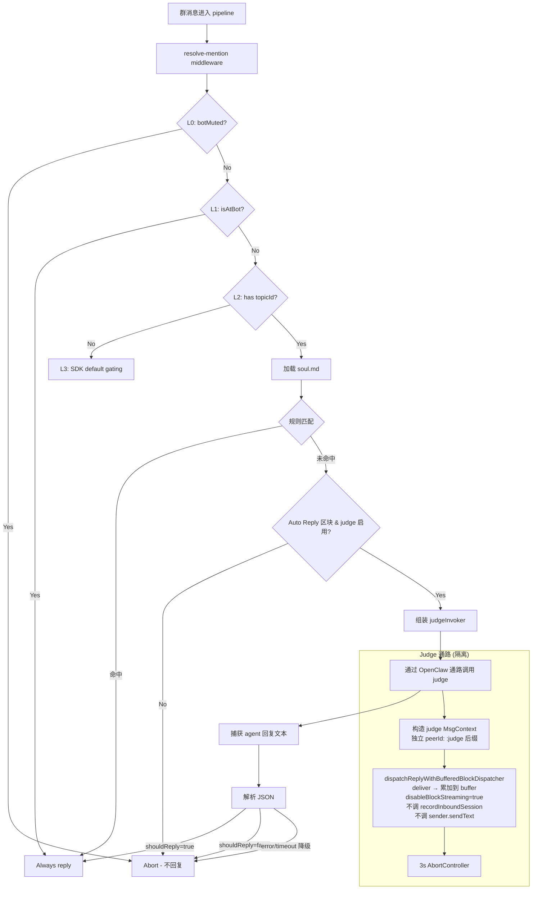

## 产品概述

让 OpenClaw 机器人在群聊话题中，即使没有被 @mention，也能根据会话上下文内容智能判断是否应该主动参与讨论并回复。

## 核心功能

- 在现有 topic-judge L2 层引入 LLM 智能判断：当规则匹配未命中时，通过 **复用 OpenClaw 已有的 agent 回复通路** 分析当前消息和近期对话历史，判定 bot 是否应该主动参与讨论
- 将话题内的近期聊天历史作为 judge 的上下文输入，让 bot 能够理解对话走向
- soul.md 作为 judge 的人设参考，指导 bot 判断"什么话题/什么时机我应该参与"
- 规则匹配保留为快速通道（命中规则直接回复，不走 LLM），LLM 仅在规则未命中时作为兜底
- LLM 判断失败时安全降级为不回复，避免异常导致 bot 刷屏
- 支持通过 soul.md 的 `## Auto Reply` 区块配置 judge 的行为指引和参与策略
- 支持通过环境变量控制开关和超时

## 技术栈

- 语言：TypeScript (Node.js)
- 运行时：OpenClaw Plugin SDK
- LLM 调用：**复用 OpenClaw PluginRuntime 已有的 `core.channel.reply.dispatchReplyWithBufferedBlockDispatcher` 通路**，通过构造隔离的 "judge session" 触发一次 agent 调用并捕获回复文本；不再引入第二条独立的 HTTP LLM 通路
- 测试：Node.js 内置 test runner

## 核心设计思想

### 为什么复用 OpenClaw 通路而不是自建 fetch

初版设计使用独立 `fetch` 调用第三方 Chat Completion API。重新审视后发现这会：

- 引入第二套 API key / endpoint / model 配置（运维成本翻倍）
- 与主回复通路使用不同后端，无法保证 judge 决策的模型能力对齐真实回复
- 绕开 OpenClaw 已有的追踪、限流、日志基础设施
- 增加 mock 复杂度（要 mock 全局 `fetch`）

**改造后方案**：judge 调用 = "开一个不落地 IM、不记录历史的隐形 agent session"，跑一次 dispatcher 拿回复文本，本地解析 JSON。零新增外部依赖。

### Judge 通路的隔离机制

1. **独立 peerId 后缀**：judge session 用 `${groupCode}:topic:${topicId}:judge` 之类的 peer，走独立的 `sessionKey` / `storePath`，与真实话题会话互不污染
2. **不调 `recordInboundSession`**：judge 调用不进入 session store，无痕迹
3. **不调 `prepareSender.sendText`**：deliver 回调只把 text 累加到内存 buffer
4. **judge context 无 InboundHistory**：历史我们自己拼进 prompt 里，agent 每次都是纯净、无状态判断
5. **`disableBlockStreaming: true`**：judge 只关心最终文本，关闭流式简化处理

## 实现方案

### 决策流程（改造后）

```
消息进入 L2 topic-judge
    │
    ├─ 1. 加载 soul.md
    ├─ 2. 规则匹配（keyword/prefix/regex） → 命中 → shouldReply=true（快速通道）
    ├─ 3. 规则未命中 → 检查 soul 是否有 `## Auto Reply` 区块 & judge 是否启用
    │       ├─ 未启用 / 无 Auto Reply 区块 → shouldReply=false
    │       └─ 启用 → 通过 OpenClaw 通路调用 judge
    │               ├─ agent 返回 YES → shouldReply=true, reason="llm-judge: <brief>"
    │               ├─ agent 返回 NO  → shouldReply=false, reason="llm-judge-skip: <brief>"
    │               └─ 超时/错误 → shouldReply=false, reason="llm-judge-error"（安全降级）
    └─ 结束
```

### 关键技术决定

1. **依赖倒置**：`topic-judge/index.ts` 不再直接引用 OpenClaw SDK 类型。改为接收调用方注入的 `judgeInvoker: (prompt) => Promise<JudgeResult>`。这样：

- `topic-judge/` 保持纯业务逻辑，无 SDK 耦合
- Mock 简单（测试里注入 stub invoker 即可）
- 未来 judge 通路想再切换实现（比如切成 SDK 内置轻量 API）不需要改 topic-judge

2. **Judge invoker 在 `resolve-mention.ts` 组装**：因为这里天然拿得到 `ctx.core / ctx.config / ctx.account / ctx.groupCode / meta.topicId`，是构造 OpenClaw 调用参数最方便的位置

3. **Prompt 设计**（合并为单条 body）：

- `Body = "You are XXX (bot persona)...\n\n## Auto Reply Strategy\n...\n\n## Recent History\n<history lines>\n\n## Current Message\n<sender>: <body>\n\nRespond ONLY with JSON {\"shouldReply\": bool, \"reason\": \"...\"}."`
- 不再区分 system/user，agent 侧统一当成一条消息处理
- 保留 `parseJudgeResponse` 的容错解析（markdown 代码块、字符串 "true/false" 等）

4. **超时与降级**：judge invoker 内挂 3s `AbortController`，超时 abort dispatcher；invoker 内部 catch 所有异常，永远返回 `{ shouldReply: false, reason: "llm-judge-error: <type>" }`

5. **成本控制**：judge peer 可通过 OpenClaw 配置绑定独立 agentId（例如挂小模型/便宜模型），无需改代码；实现层不假设特定模型

6. **可选：judge 用独立 agent 覆盖**：`resolve-mention.ts` 里构造 judge context 时可以在 config 层允许指定 `judgeAgentId`（从 account.config 读），未指定则复用当前话题的 agent

### 与原方案的关键替换

| 项目 | 旧方案（fetch） | 新方案（复用 OpenClaw） |
| --- | --- | --- |
| LLM 调用入口 | `fetch(config.apiUrl, ...)` | `core.channel.reply.dispatchReplyWithBufferedBlockDispatcher(...)` |
| Judge 配置 | `apiUrl` / `apiKey` / `model` / `timeoutMs` | 仅 `enabled` + `timeoutMs`（可选 `judgeAgentId`） |
| 环境变量 | `YUANBAO_LLM_JUDGE_API_URL/KEY/MODEL/TIMEOUT_MS` | 仅保留 `YUANBAO_LLM_JUDGE_ENABLED` / `YUANBAO_LLM_JUDGE_TIMEOUT_MS` |
| Prompt 结构 | system + user 两条消息 | 合并成单条 body |
| Session 隔离 | 无需（独立 HTTP 请求） | 通过独立 peerId + 不调 recordInboundSession + 不调 sender.sendText |
| topic-judge/index.ts 依赖 | 直接依赖 llm-judge.ts | 依赖注入的 judgeInvoker（SDK 隔离） |
| 测试 mock 点 | mock 全局 `fetch` | 直接 mock 传入的 judgeInvoker 函数 |


## 实现备注

- **性能**：规则快速通道 O(keywords + prefixes + regexes)；仅在规则未命中时触发 judge 调用；chatHistories 取最近 5-10 条，prompt 总长度控制在 2000 tokens 以内
- **日志**：复用 `ctx.log`，judge 请求仅记录 verdict/reason/耗时（不记录完整 prompt/response 避免日志膨胀）；错误时记录具体错误类型
- **可观测**：因为走 OpenClaw 通路，judge 的 trace/延迟/错误会自动被现有基础设施采集，无需额外埋点
- **向后兼容**：无 `## Auto Reply` 区块的 soul.md 行为不变（退出 judge 路径，走原 "no rule matched" 逻辑）；不改变 L0/L1/L3 层任何行为
- **Blast radius**：改动集中在 `topic-judge/` 目录 + `resolve-mention.ts` 里 judge invoker 组装；`dispatch-reply.ts` 和其他 middleware 不动
- **不需要新的插件依赖**：`core.channel.reply.dispatchReplyWithBufferedBlockDispatcher` 已经在 `dispatch-reply.ts` 中被使用过

## 架构设计



## 目录结构

```
src/business/pipeline/topic-judge/
├── index.ts                    # [MODIFY] 参数从 llmJudgeConfig 改为 judgeInvoker（依赖倒置），在规则未命中时调用 judgeInvoker
├── index.test.ts               # [MODIFY] mock 从 fetch 改为直接注入 judgeInvoker stub
├── llm-judge.ts                # [REWRITE] 从 fetch 版重写为 createOpenclawJudgeInvoker。基于传入的 { core, config, groupCode, topicId } 组装 judge MsgContext，跑 dispatcher，捕获回复文本，解析 JSON。保留 parseJudgeResponse 容错逻辑。
├── llm-judge.test.ts           # [REWRITE] mock 从 fetch 改为 mock core.channel.reply.dispatchReplyWithBufferedBlockDispatcher。覆盖：deliver 累积文本、abort 超时、agent 抛错、非 JSON 响应、markdown 代码块。
├── prompt-builder.ts           # [MODIFY] 输出改为单条 body（保留 systemPrompt + userPrompt 内部拼接，最终 join 成一段）；hasAutoReplyConfig 字段保留
├── prompt-builder.test.ts      # [MODIFY] 验证合并后 body 包含人设/策略/历史/当前消息四段
├── soul-loader.ts              # [KEEP] 无需修改
└── soul-loader.test.ts         # [KEEP] 无需修改

src/business/pipeline/middlewares/
└── resolve-mention.ts          # [MODIFY] 删除 resolveLlmJudgeConfig 中 apiUrl/apiKey/model 逻辑；改为构造 judgeInvoker（内部调 OpenClaw 通路）并传给 shouldBotReplyInTopic

src/types.ts                    # [MODIFY] YuanbaoAccountConfig.llmJudge 简化为 { enabled?: boolean; timeoutMs?: number; judgeAgentId?: string }，删除 apiUrl/apiKey/model 字段
```

## 关键代码结构

```typescript
// src/business/pipeline/topic-judge/llm-judge.ts

import type { PluginRuntime, OpenclawConfig } from "openclaw/plugin-sdk";
import type { ModuleLog } from "../../../logger.js";

export interface JudgeResult {
  shouldReply: boolean;
  reason: string;
}

/** Function signature that topic-judge depends on. SDK details hidden here. */
export type JudgeInvoker = (input: {
  prompt: string;
  log?: ModuleLog;
}) => Promise<JudgeResult>;

export interface CreateOpenclawJudgeInvokerOptions {
  core: PluginRuntime;
  config: OpenclawConfig;
  /** Original group inbound context — used as template for judge MsgContext. */
  groupCode: string;
  topicId: string;
  fromAccount: string;
  /** Judge timeout in ms (default 3000). */
  timeoutMs?: number;
  /** Optional override: use a specific agentId for judge (defaults to route resolver). */
  judgeAgentId?: string;
}

/**
 * Build a JudgeInvoker that runs prompt through OpenClaw's agent pipeline
 * with a fully isolated session, captures the reply text, and parses JSON.
 *
 * Never throws — always resolves to a safe `{ shouldReply: false, reason: ... }`
 * on any failure (timeout, agent error, parse error).
 */
export function createOpenclawJudgeInvoker(
  opts: CreateOpenclawJudgeInvokerOptions,
): JudgeInvoker;

// Exported for testing
export { parseJudgeResponse as __parseJudgeResponseForTests };
```

```typescript
// src/business/pipeline/topic-judge/index.ts

import type { JudgeInvoker } from "./llm-judge.js";

export interface TopicJudgeInput {
  topicId: string;
  rawBody: string;
  senderNickname?: string;
  soul: string;
  historyTail?: string[];
  /** Judge invoker. When provided (and `## Auto Reply` exists in soul), enables Phase 2. */
  judgeInvoker?: JudgeInvoker;
  log?: ModuleLog;
}
```

```typescript
// src/business/pipeline/topic-judge/prompt-builder.ts

export interface BuiltPrompt {
  /** Single combined prompt body for the agent. */
  prompt: string;
  /** Whether an Auto Reply section was found (controls judge activation). */
  hasAutoReplyConfig: boolean;
}

export function buildJudgePrompt(input: BuildPromptInput): BuiltPrompt;
```

## Agent Extensions

无需额外 SubAgent；SDK 通路已在 `dispatch-reply.ts` 中验证可用，直接复用。